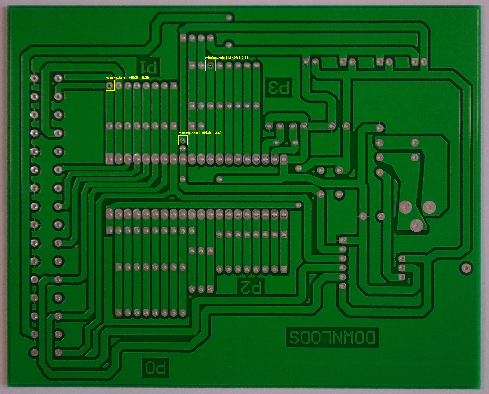
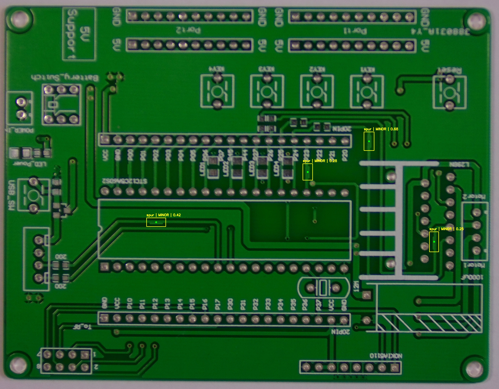
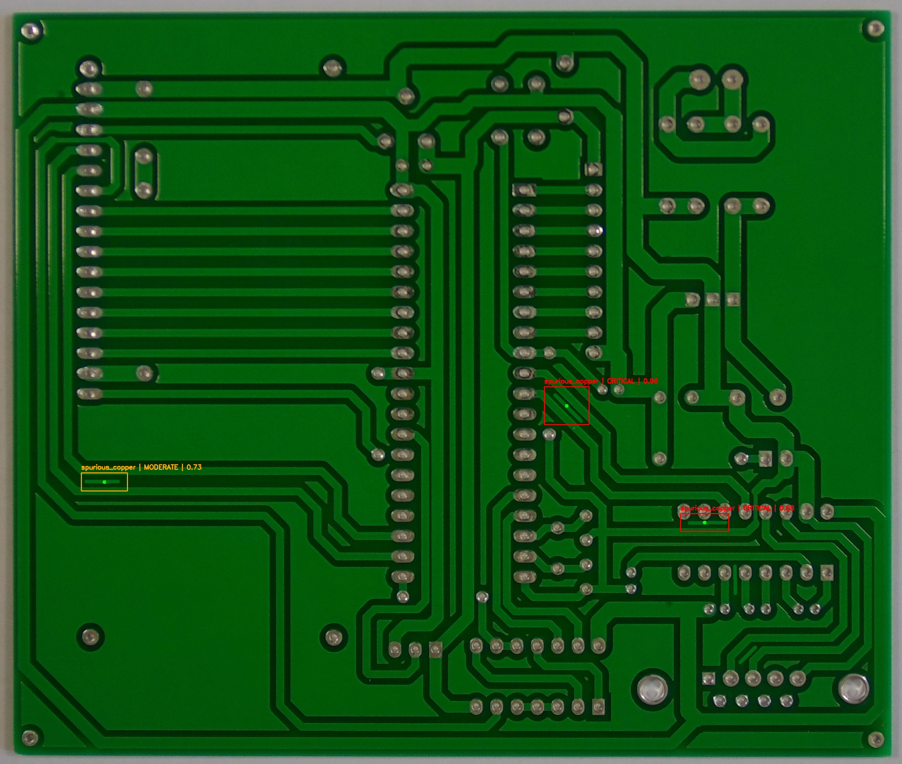
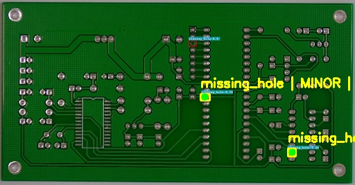

# Automated Quality Inspection System for PCBs


## 🔍 Project Overview
This project is an AI-powered automated visual inspection system designed to detect, classify, and assess manufacturing defects on Printed Circuit Boards (PCBs) in real-time. 

Utilizing the **YOLOv8** object detection architecture and **OpenCV** for post-processing, the system analyzes images to identify 6 distinct types of PCB faults. Beyond simple detection, it includes a heuristic logic layer that calculates the severity of each defect ("Critical" vs. "Minor") based on defect size and model confidence, providing actionable insights for quality control.

## 🚀 Key Features
* **Multi-Class Detection:** Identifies 6 specific PCB defect types.
* **Precision Localization:** Outputs exact bounding boxes and (x, y) center coordinates for every fault.
* **Severity Assessment:** Automatically grades defects as **Critical**, **Moderate**, or **Minor** based on their physical dimensions relative to the board size.
* **False Positive Rejection:** Validated against defect-free "Golden Samples" to ensure reliability.

## 🛠️ Defect Classes
The model is trained to recognize the following manufacturing errors:
1.  **Missing Hole**
2.  **Mouse Bite** (Chips along the edge)
3.  **Open Circuit** (Broken traces)
4.  **Short Circuit** (Unwanted connections)
5.  **Spur** (Copper protrusions)
6.  **Spurious Copper** (Random copper splashes)

---

## 📸 Inspection Results

Below are samples generated by the system. The annotations include the **Defect Type**, **Center Coordinates**, and **Calculated Severity**.

### 1. Defective Samples (Detected & Classified)
*The system successfully identifies multiple defects, localizes them with bounding boxes, and assigns a severity rating.*

| Sample A | Sample B |
| :---: | :---: |
|  |  |

| Sample C | Sample D |
| :---: | :---: |
|  |  |

### 2. Defect-Free "Golden Sample"
*The system is tested on clean boards to ensure it does not "hallucinate" defects where none exist, but hallucination inevitably creeps in.*



---

## 🧠 Logic & Severity Assessment
The system uses a post-processing script to evaluate the impact of a defect. The severity logic is determined by the bounding box area relative to the total image size:

* 🔴 **CRITICAL:** Defect width > 15% of image width OR Confidence > 85%
* 🟠 **MODERATE:** Defect width > 5% of image width
* 🟡 **MINOR:** Small cosmetic defects

## 💻 Tech Stack
* **Core Model:** YOLOv8 (Ultralytics)
* **Image Processing:** OpenCV (cv2)
* **Language:** Python
* **Visualization:** Matplotlib

## 📦 Requirements
To run the inference script, the following dependencies are required:
```text
ultralytics
opencv-python
numpy
matplotlib
